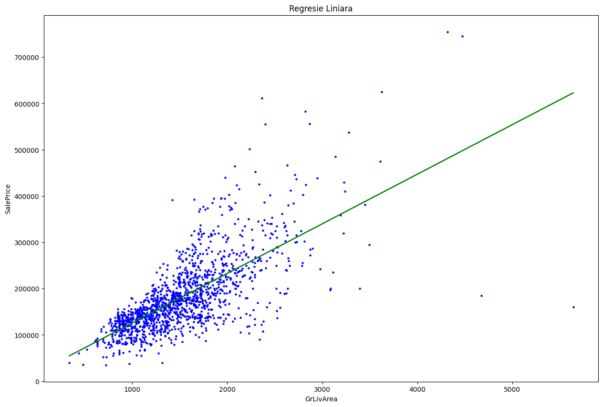
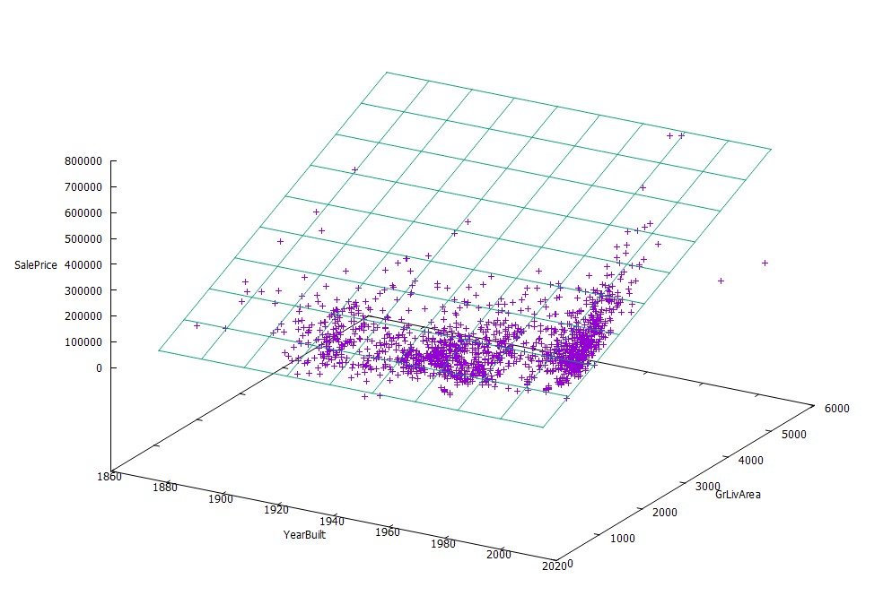

# Linear Regression Algorithm in Scala


## Ce este Regresia Liniara?

Imaginati-va ca avem o multime de puncte pe o foaie de hartie,
fiecare punct avand o valoare pe axa orizontala si una pe axa verticala.
**Regresia liniara** este o tehnica de Machine Learning care produce
o dreapta cat mai potrivita printre aceste puncte,
astfel incat suma distantelor dintre puncte si linia trasata sa fie minima.
Pentru 2 axe (*OX* si *OY*), o regresie liniara consta intr-o
dreapta descrisa de ecuatia `y = a * x + b`,
unde *a* si *b* sunt constante ce trebuiesc determinate (de catre algoritm)
pentru a minimiza distatna dintre puncte si dreapta de regresie.


Vom numi coordonatele pe axa *OX* a punctelor din poza de mai jos **input**.
Valoarea de pe axa *OY* a fiecarui punct o vom numi valoarea reala.
In plus, valorile *y(x)* de pe dreapta determinata se vor numi **predictii**.
Cu aceasta taxonomie, putem spune ca regresia liniara estimeaza o dreapta,
astfel incat, suma tuturor erorilor predictiilor
(diferenta intre valoarea prezisa si valoarea reala) sa fie **minima**.



> Ecuatia dreptei din imagine este: `y = 118.06894201605218 ∗ x + 0.2687269842929364`.


In graficul de mai sus sunt reprezentate preturile de vanzare ale unor proprietati 
(majoritatea case cu mai multe etaje), in raport cu suprafata totala locuibila a acestora.
Axa *OX* reprezinta suprafata, iar *OY* reprezinta pretul.
Privind graficul de la distanta se poate observa o **dependenta liniara** intre preturi si suprafete.
Putem estima pretul unei proprietati ca o **functie/dreapta** `y = a ∗ x + b`,
unde *OX* reprezinta suprafata, iar *OY* reprezinta pretul.

O astfel de dreapta este ilustrata cu verde in graficul de mai sus si puteti observa 
ca aceasta estimeaza foarte bine unele preturi, cele ale proprietatilor sub 2000 mp, 
si mai putin bine pe cele cu suprafata mai mare.


In general, pretul unei case nu depinde doar de suprafata total, ci si de alte **atribute/feature-uri**.
Astfel, daca luam si alte atribute ale locuintei in calcul,
precum anul in care a fost construita,
vom putea obtine o estimare de pret mai buna.
In acest caz, estimarea pretului se face folosind o
functie liniara cu **doua variabile** `y = a * x0 + b * x1 + c`, unde:

- *x0* si *x1* reprezinta suprafata totala, respectiv anul constructiei

- *a*, *b* si *c* reprezinta parametrii modelului, pe care, folosind regresia, ii calculam astfel incat sa minimizeze suma tuturor erorilor predictiilor.

Puteti vizualiza reprezentarea grafica a acestei situatii cu acest fisier: [3d_graph.html](3d_graph.html)


In general, regresia poate fi implementata cu un singur atribut, cu doua sau si cu mai multe,
in functie de informatiile disponibile despre procesul ce se doreste a fi prezis.


## Implementarea algoritmului


### Citierea din CSV

Datele sunt in format CSV, in care fiecare coloana reprezinta un atribut sau feature, iar valorile de pe fiecare linie sunt separate prin virgule. Mai jos se gaseste un exemplu de fisier CSV avand un singur feature numeric (suprafata locuita totala) si rezultatul asteptat pe ultima coloana (pretul).

extragem datele dintr-un fisier **CSV** intr-un obiect de tip `Dataset`, care va mentine intern o structura **tabelara** (matriceala) de tip `List[List[String]]`.


### Selectarea coloanelor de interes

Algoritmul nu are nevoie de toate coloanele fisierului CSV pentru regresie,
ci doar de cele de interes.
De aceea, am implementata metodele `selectColumn` si `selectColumns`,
care vor intoarce un set de date restrands, ce contine doar coloanele al caror nume
este primit ca parametru.


```scala
def selectColumn(col: String): Dataset
def selectColumns(cols: List[String]): Dataset
```


### Impartire Dataset


Toate metodele de Machine Learning:

- folosesc doar o parte din datele disponibile pentru **estimarea** parametrilor (proces numit **antrenare**).
- un procent mai mic (~20%) din date este rezervat pentru **a evalua** performanta modelului invatat, model care in cazul nostru este regresia liniara. Este important ca aceste date sa fie noi (ne-vazute in timpul antrenarii), pentru ca evaluarea sa arate cat mai clar cum se comporta modelul pe date ce nu au facut parte din antrenare.


```scala
def split(percentage: Double): (Dataset, Dataset)
```


Metoda `split` imparte setul de date in doua seturi.
Valoarea `percentage` este intre `0` si `0.5` si reprezinta procentul din dataset ce va fi pastrat pentru evaluare, din totalul de intrari ale dataset-ului.
Metoda va intoarce o pereche de dataset-uri: unul mai mare (numit “de antrenare”) si unul mai mic (“de testare/validare”). Pentru aceasta impartire, urmati pasii urmatori:

- 1\. Sortati setul de date crescator dupa prima coloana
- 2\. Pentru fiecare `1/percentage - 1` intrari consecutive din dataset-ul sortat, adaugati o intrare in dataset-ul de evaluare, iar restul - in cel de training.


### Operatii cu matrici | Propagarea erorilor


Pentru ca regresia liniara functioneaza doar cu date numerice, avem nevoie sa transformam un `Dataset`, ale carui campuri sunt de tip `String`, intr-o matrice de Double, daca se poate. Matricile vor reprezenta intern datele ca `Option[List[List[Double]]]` tocmai pentru a ilustra ideea de aparitie a unei erori in timpul conversiei sau al altor operatii.

`Option` este un **TDA** (Tip de Date Abstract) **deja existent in Scala** si reprezinta o valoare care s-ar putea sa nu existe. Option are 2 constructori:

- `None` - valoarea nu exista
- `Some(x)` - valoarea exista si este x

Vi-l puteti imagina implementat ca mai jos:


```scala
trait Option {}
case class Some(value: List[List[Double]]) extends Option{}
case object None extends Option{}
```

Se foloseste `Option` pentru a trata cazurile de eroare ce pot aparea la operatiile de inmultire si scadere. Astfel, o matrice ce contine un None contine o “eroare”.


### Operatii cu matrici | Functii

- Lungimea unei matrici
- Latimea unei matrici
- Transpunerea unei matrici
- Map
- Scadere a doua matrici
- Inmultirea dintre doua matrici
- Adaugarea unei coloane la sfarsitul unei matrici


```scala
def height: Option[Int]
def width: Option[Int]
def apply(dataset: Dataset): Matrix 
def map(f: Double => Double): Matrix
def -(other: Matrix): Matrix
def *(other: Matrix): Matrix
def ++(x: Double): Matrix
```


In general, cand dorim sa calculam o regresie, trebuie sa determinam un termen constant  *b* din ecuatia  `y = a * x + b`.
Insa, din punct de vedere al implementarii, ne este mai usor sa calculam coeficientii 
*a* si  *b* daca ecuatia este adaptata la forma `y = a * x + b * C`.
, ceea ce ne permite sa folosim operatii de inmultire matriceala.
In acest context, *C* este o coloana care contine aceeasi valoare constanta pe toate randurile sale.


### Algoritmul de regresie - `Gradient Descent`


Cel mai simplu si des intalnit mod de a gasi parametrii din ecuatia dreptei care descrie regresia aleasa este algoritmul **Gradient Descent**, care presupune urmatorii pasi:

- 1\. **Incarcarea si selectia datelor**:
  - Se porneste de la un set de date care contine multiple coloane.
  - Fiecare rand reprezinta o inregistrare, iar coloanele ofera diverse informatii despre aceste inregistrari.
  - Una dintre coloane este variabila pe care se doreste estimarea (ex: pretul unei case), iar restul coloanelor contin date pentru a face aceasta estimare (ex: marimea casei, numarul de camere, etc.).
  - Functia `selectColumns` din `Dataset` este utilizata pentru a pastra doar coloanele de interes.
  - Setul de date rezultat este apoi impartit in doua:
    - Setul de **antrenare** - pentru a determina parametrii regresiei.
    - Setul de **validare** - pentru a evalua performanta regresiei.

- 2\. **Crearea matricei cu date de intrare (X)**:
  - Setul de date de antrenare este folosit pentru a crea matricea `X`.
  - Fiecare rand din `X` contine valorile atributelor fiecarei locuinte.
  - Se adauga o coloana suplimentara cu valoarea 1 la finalul matricei `X` pentru a include un termen liber, facilitand astfel calculele.
  - Daca exista `m` locuinte si `n` atribute, `X` va fi o matrice de dimensiune `m x (n+1)`.
  - Functia `++` din `Dataset` este folosita pentru a construi aceasta matrice.

- 3\. **Initializarea coeficientilor regresiei (W)**:
  - Se initializeaza un vector de parametri `W` cu dimensiunea `(n+1) x 1`.
  - Fiecare element din `W` reprezinta coeficientul asociat fiecarui atribut numeric din `X`.
  - Initial, toate valorile din `W` sunt setate la 0, urmand sa fie ajustate de algoritmul Gradient Descent.

- **4\. Gradient Descent**
Pentru un numar predefinit de pasi (`gradient_descent_steps`), algoritmul executa urmatorii sub-pasi:

  - 4\.1\. **Calculul estimarilor**
     - Se foloseste ipoteza curenta pentru a inmulti matricea `X` de dimensiune `m x (n+1)` cu vectorul `W` de dimensiune `(n+1) x 1`, rezultand un vector de estimari de dimensiune `m x 1`.
     - Fiecare valoare estimata reprezinta pretul prezis pentru fiecare locuinta, calculat astfel: `W0 + W1 * X1 + W2 * X2 + ... + Wn * Xn`

  - 4\.2\. **Calculul erorii**
     - Se defineste o functie de eroare ca diferenta dintre pretul prezis si cel real. Pretul real al fiecarei locuinte este stocat intr-un vector `Y` de dimensiune `m x 1`.
     - Eroarea va fi, de asemenea, un vector de dimensiune `m x 1`.

  - 4\.3\. **Calculul gradientului**
     - Gradientul indica directia si magnitudinea ajustarii necesare pentru coeficientii `W`.
     - Gradientul se calculeaza inmultind transpusa matricei `X` (de dimensiune `(n+1) x m`) cu vectorul de eroare (de dimensiune `m x 1`), apoi se imparte fiecare element la `m` pentru media aritmetica.
     - Rezultatul este un vector de dimensiune `(n+1) x 1`.

  - 4\.4\. **Actualizarea ipotezei (W)**
     - `W` se actualizeaza scazand produsul dintre gradient si un factor de invatare (`alpha`), influentand viteza de convergenta.
     - Noua valoare a lui `W` va fi folosita in urmatoarea iterare a algoritmului.

- 5\. **Evaluarea performantei regresiei**:
Dupa executarea pasilor de `gradient_descent_steps`, algoritmul aplica regresia pe setul de validare pentru a calcula predictiile si eroarea finala - media aritmetica a diferentei dintre pretul prezis si cel real.

- 6\. **Output**: Ipoteza finala `W` si eroarea pe setul de validare sunt returnate.


```scala
def regression(
  dataset_file: String, 
  attribute_columns: List[String],
  value_column: String,
  test_percentage: Double,
  alpha: Double,
  gradient_descent_steps: Int
): (Matrix, Double)
```


Parametrii metodei `regression` sunt:

- **dataset_file** - Calea catre fisierul care contine setul de date.
- **attribute_columns** - Lista cu numele coloanelor care vor fi folosite ca atribute.
- **value_column** - Numele coloanei care va fi folosita ca variabila tinta.
- **test_percentage** - Procentul de impartire intre setul de date de antrenare si cel de validare.
- **alpha** - Rata de invatare utilizata in actualizarea parametrilor modelului.
- **gradient_descent_steps** - Numarul de iteratii pentru care algoritmul Gradient Descent va fi executat.


Metoda `regression` indeplineste urmatoarele lucruri:
- 1\. Imparte (divizeaza) setul de date initial in doua subseturi: de antrenare si de validare, folosind `test_percentage`.
- 2\. Preproceaza setul de antrenare pentru a include coloana de `1`-uri, generand astfel matricea `X` de dimensiune  `m ∗ (n + 1)`,
unde `m` este numarul de linii din setul de antrenare.
- 3\. Initializeaza vectorul de parametri `W` cu dimensiuni 
`(n + 1) ∗ 1`, toate valorile fiind setate initial la `0`.
- 4\. Aplica algoritmul `Gradient Descent` pe setul de antrenare pentru numarul specificat de `steps`, ajustand parametrii `W` folosind rata de invatare `alpha`.
- 5\. Dupa finalizarea pasilor de `Gradient Descent`, se foloseste `W` pentru a genera predictii pe setul de validare.
- 6\. Calculeaza eroarea totala ca media aritmetica a diferentelor intre valorile prezise si valorile reale din setul de validare.
- 7\. Intoarce un tuple format din vectorul de parametri `W` ajustat si suma erorilor calculate pentru setul de validare.


### Programarea Functionala


Desi algoritmul de regresie liniara este implementat in `Scala`,
care este este un un limbaj **OOP** (Object-Oriented Programming),
codul respecta paradigmele de programare ale unui **limbaj functional**:
- Codul este construit pe baza functiilor
- Variabilele sunt **imutabile**, odata create, nu mai pot fi modificate
- Modificarea unei variabile presupune crearea unei noi variabile
- Se foloseste `Option` (`None`/`Some(x)`) pentru propagarea erorilor


## Plotting


Pornind de la fisierul `houseds.csv`, se realizeaza o regresie pe baza atributelor (coloanelor) `GrLivArea` si `YearBuilt`, incercand prezicerea valoarilor de pe coaloana `SalPrice`.

Se reprezinta grafic, folosind [gnuplot](http://www.gnuplot.info/) planul de regresie si sample-urile.


```sh
$ sudo apt-get install gnuplot
```


```sh
$ which gnuplot
$ gnuplot --version
```


`Plot.plt`:
```plot
#!/usr/bin/env gnuplot


A = -0.46562730905168315
B = 13.606240746925756
C = 101.46591826674094

set datafile separator ","
set xlabel "YearBuilt"
set ylabel "GrLivArea"
set zlabel "SalePrice" offset -5,0,0
splot 'datasets/houseds.csv' using "YearBuilt":"GrLivArea":"SalePrice" with points, A + B * x + C * y
```


Rulare:
```sh
$ gnuplot -p plot.plt
```





## Testare
---

Pentru a testa codul sursa,
ruleaza in terminal urmatoarea comanda
(in directorul radacina al repository-ul de git):

```sh
$ sbt test
```
